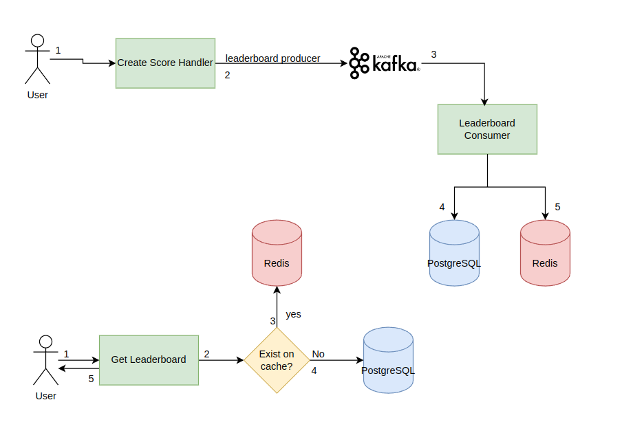

# Real-time leaderboard
Inspired by https://roadmap.sh/projects/realtime-leaderboard-system.
A real-time leaderboard application written in go.

# How to run?
First, run the dependencies through docker compose using the command:
```bash
docker-compose up -d
```

Run the go project:
```bash
go run cmd/main.go
```

## Architecture Overview:


## Routes:
- POST /singup
REQUEST BODY:
```json
{
	"username": "johndoe",
	"password": "somepassword"
}
```

- POST /login
REQUEST BODY:
```json
{
	"username": "johndoe",
	"password": "somepassword"
}
```

- POST /game
REQUEST BODY:
```json
{
	"name": "mygame"
}
```

- POST /user-score
REQUEST BODY:
```json
{
	"score": 15,
	"user_id": 1,
	"game_id": 1
}
```

- GET /leaderboard
RESPONSE BODY:
```json
[
	{
		"user_id:": "johndoe",
		"score": 165
	},
	{
		"user_id:": "kaiquecaires",
		"score": 295
	}
]
```

- GET /games
RESPONSE BODY
```json
[
	{
		"id": 1,
		"name": "mygame"
	}
]
```

## Done
- [x] User sign up
- [x] Send User Score Data
- [x] Postgresql User Score Consumer
- [x] Create a game
- [x] Replace Sarama for Confluent Kafka library
- [x] Login route
- [x] Middleware for JWT authentication
- [x] Improve the consumer logic by adding consumer groups and multiple workers
- [x] Route to get leaderboard
- [x] Implement Cache Warm-up on redis
- [x] Draw the System Design
- [x] Implement redis as cache

## Todo
- [ ] Handle with idempotency on user score
- [ ] Handle with retries on save on redis

# References
https://medium.com/@mayilb77/design-a-real-time-leaderboard-system-for-millions-of-users-08b96b4b64ce
